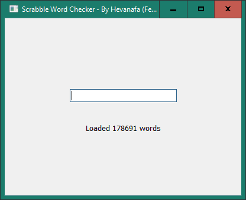
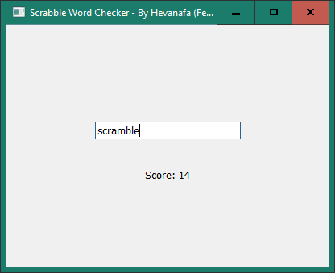

# Scrabble Word Checker

A small utility to check if a word exists in the Scrabble dictionary, and also calculate the score

I made this to get started with cross-platform GUI development in C++





## Requirements

- [Qt Creator](https://www.qt.io/development/download-open-source) (Qt 18.0.2 at the time of writing)

## Building

- Open `CMakeLists.txt` with Qt Creator
- Change the build setting to **Release**
- Open **Build** menu > **Build Project** (or `Ctrl+B`)

In order to make the exe work as expected, copy the dictionary file (`TWL06.txt`) to the build folder where the EXE is

## Deployment

Use this command to gather all the required DLLs

```powershell
windeployqt .\Scrabble_word_checker.exe
```

It depends on where the `windeployqt` is. In my case, it's:

```powershell
E:\Qt\6.10.2\mingw_64\bin\windeployqt.exe .\Scrabble_word_checker.exe
```

This copies approximately 65 MB of DLL files into the same folder as where the executable file is

## Credits

The Scrabble dictionary is obtained from [jessicatysu/scrabble](https://github.com/jessicatysu/scrabble)
